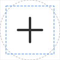

# Icon style guide

**For images displayed in circular crops in both light mode and dark mode**

This guide gives best practices for designing and formatting icons so they render cleanly when cropped into a circle and remain visible in both light and dark themes.

## Canvas and layout

### Artboard size

- Use a square artboard: 100x100, 256x256, etc. 
- All icons **must fit fully inside a circle** that touches the edges of the square

### Safe area

- Keep all artwork within **80% of the canvas**
- Leave at least **10% padding** from the edge on all sides

This ensures the icon isn't cut off when masked in a circle.

### Centering

- Visually center the icon horizontally and vertically. 
- Avoid overly tall or wide silhouettes that feel off-balance once cropped. 

## Content

- Use simple shapes that are clearly visible at small sizes 
- Avoid using text-based logos unless the logo is text-only 

Sometimes there are multiple logos to choose from. When in doubt, always go for the logo that looks like a simple icon.

## Colors and backgrounds

Icons must be visible in both light and dark mode themes. Avoid using transparent backgrounds, unless the icon has colors that are clearly visible in both themes. Otherwise, the icon **must** have a background. 

It is not recommended to use a circular background with transparent corners. The icon will be cropped into a circle in the UI. It is always best to use a square background that fills the entire artboard. 

## Formats

SVG vectors are always best. If you must use a PNG raster, make sure it is high quality, but also make sure the file size is reasonable. 

Do not use animations. 

### Embedded images or nested SVGs

Avoid embedded raster images, such as PNG-in-SVG. 

#### ❌ Do NOT use:

- `<image>` tags (PNG/JPEG inside an SVG)
- `<foreignObject>`
- Nested `<svg>` elements inside the main SVG

#### ✔️ Use instead:

Pure vector paths and shapes only (`<path>`, `<circle>`, `<rect>`, `<line>`, `<polygon>`, etc.)

### CSS styling inside SVGs

#### ❌ Avoid: 

- `<style>` blocks in SVG
- Embedded CSS selectors (.cls-1 { fill: red; })

#### ❌ Do NOT use:

- Links to external CSS files
- Inline `class=` attributes that rely on external stylesheets 

### Filters and effects

SVG filters frequently break or render inconsistently. 

#### ❌ Avoid:

- `<filter>`
- `<feGaussianBlur>`
- `<feDropShadow>`
- `<feColorMatrix>`
- `<mask> that relies on filter effects`

#### ✔️ OK to use:

Pure path operations (boolean geometry done before export)

## Examples

### What not to do

The following icon will look uneven when cropped in a circle, and the shadow will be outside of the crop. The shadow will also be invisible in dark mode. 


The following icon will look uneven when cropped, because it is more tall than wide. The top and bottom edges will also touch the edges of the circle. Lastly, it will be nearly invisible in dark mode. 


The following icon is blurry. It may look sharper at smaller sizes, but it will never look crisp. 


The following icon has a lot of small details that will be unintelligible at small sizes. 


The following icon has a circular background that is smaller than the artboard + transparent corners, so it will look smaller than the circle crop used in the UI. It will thus look smaller than other icons displayed alongside it. 


The following PNG icon is too small. It will never look crisp. It is displayed here larger than the source image. The source image is only 20x20. 


The following icon has small text that will be very hard to read at small sizes. It also has a transparent background, so the dark text will be invisible in dark mode. 


### What to do

The following icon uses clearly defined line art on a solid background, with ample space around the main artwork. It will look good in both light mode and dark mode at big and small sizes. 


The following icon guide can be helpful for comparing icons. 



- **Grey circle** = circular crop mask example - anything outside this circle will be cut off
- **Blue dashed square** = 80% safe content area (with 10% padding)
- **Plus sign** = example icon correctly centered and contained within the safe area.

### Tools

You can use [svgviewer.dev](https://svgviewer.dev) to hand-edit SVGs. You can also give an SVG to ChatGPT and ask it to edit the SVG for you. An example prompt: 

```Edit the following SVG to have a solid red background and center the current content with an added 10% padding so the resulting SVG is 120x120.```
